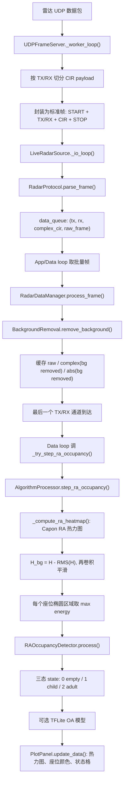

# UDP 模式下 RA-OCCUPANCY 信号处理流程

本文说明 `gui_main.py` 中，实时 `UDP` 模式选择 `RA-OCCUPANCY` 算法时，雷达信号从网络接收、协议解析、缓存、背景去除、RA 热力图计算，到最后座位状态显示的完整处理链路。

相关文件：

- `gui_main.py`
- `UDP_data_listen.py`

## 0. 总流程



注意：`RA-OCCUPANCY` 分支里的 `d["occupancy"]` 最终不是单纯 0/1，而是 `state` 三态字典：`0=empty`、`1=child`、`2=adult`。

## 1. UDP 服务启动

当配置里的 `connection_mode` 是 `UDP` 或 `BD` 时，实时数据源会启动 `UDPFrameServer`。`BD` 也走同一个 UDP 接收入口。

```python
class LiveRadarSource:
    def start(self):
        self.running = True; RadarProtocol.update_protocol(self.config.ft_len)
        if self.config.connection_mode in ('UDP', 'BD'):
            self.udp_server = UDPFrameServer(ConfigAdapter(self.config)); self.udp_server.start()
```

这里先调用：

```python
RadarProtocol.update_protocol(self.config.ft_len)
```

它会按当前 `ft_len` 更新协议帧长度：

```python
class RadarProtocol:
    START_SIGN = b'\xff\x00\xff\x00'; STOP_SIGN = b'\xf0\x00\xf0\x00'
    HEADER_LEN = 4; FOOTER_LEN = 4; ANTENNA_INFO_LEN = 2
    FT_LEN = 32; CIR_DATA_LEN = 128; FRAME_LEN = 138

    @classmethod
    def update_protocol(cls, ft_len):
        cls.FT_LEN = ft_len
        cls.CIR_DATA_LEN = ft_len * 4
        cls.FRAME_LEN = cls.HEADER_LEN + cls.ANTENNA_INFO_LEN + cls.CIR_DATA_LEN + cls.FOOTER_LEN
```

解释：

- 每个 CIR tap 是一个复数 IQ：`I:int16 + Q:int16`，共 4 字节。
- `CIR_DATA_LEN = ft_len * 4`。
- 标准帧由 `4B START + 2B TX/RX + CIR payload + 4B STOP` 组成。

## 2. UDP 原始数据包切分成标准帧

`UDPFrameServer` 在 `UDP_data_listen.py` 中实现。它监听 UDP socket，收到一个完整 UDP packet 后，按配置的 TX/RX 列表拆成多个单通道帧。

```python
class UDPFrameServer:
    def __init__(self, config):
        self.ip = config.UDP_IP
        self.port = config.UDP_PORT
        self.config = config
        
        self.sock = socket.socket(socket.AF_INET, socket.SOCK_DGRAM)
        self.sock.bind((self.ip, self.port))
        self.sock.settimeout(1.0) 
        
        self.frame_queue = queue.Queue(maxsize=1000)
        self.bytes_per_channel = config.FT_LEN * 4 
```

实际接收与切分：

```python
def _worker_loop(self):
    total_tx = len(self.config.UDP_TX_LIST)
    total_rx = len(self.config.UDP_RX_LIST)
    expected_size = total_tx * total_rx * self.bytes_per_channel

    while self.is_running:
        data, addr = self.sock.recvfrom(4096)
        
        if len(data) != expected_size:
            continue

        offset = 0
        for tx_id in self.config.UDP_TX_LIST:
            for rx_id in self.config.UDP_RX_LIST:
                cir_chunk = data[offset : offset + self.bytes_per_channel]
                offset += self.bytes_per_channel
                
                antenna_info = struct.pack('BB', tx_id, rx_id)
                
                full_frame = (
                    self.config.START_SIGN + 
                    antenna_info + 
                    cir_chunk + 
                    self.config.STOP_SIGN
                )
                
                if not self.frame_queue.full():
                    self.frame_queue.put(full_frame)
                else:
                    self.frame_queue.get_nowait()
                    self.frame_queue.put(full_frame)
```

解释：

- 一个 UDP packet 里包含所有 `TX x RX` 通道的数据。
- 默认布局是 `udp_tx_list=[1,2]`、`udp_rx_list=[4,5,6,7]`，所以一轮有 8 个通道。
- 代码假设 UDP packet 内顺序是：`TX1-RX4/5/6/7 -> TX2-RX4/5/6/7`。
- 每个通道被包装成统一的标准帧，放进 `frame_queue`。
- 队列满时丢掉旧帧，保留实时性。

## 3. IO 线程取标准帧并解析成复数 CIR

`LiveRadarSource._io_loop()` 从 `UDPFrameServer` 的队列里取标准帧，再调用 `RadarProtocol.parse_frame()`。

```python
def _io_loop(self):
    while self.running:
        raw_chunk = b''
        try:
            if self.config.connection_mode in ('UDP', 'BD'):
                f = self.udp_server.get_frame()
                raw_chunk = f if f else b''
                time.sleep(0.002) if not f else None
        except:
            pass
        if not raw_chunk:
            continue
        if self.is_recording and self.record_file:
            self.record_file.write(raw_chunk)
        parsed = RadarProtocol.parse_frame(raw_chunk)
        if parsed:
            raw_frame = bytes(raw_chunk)
            self.frame_count_sec += 1
            self.data_queue.put(parsed + (raw_frame,)) if not self.data_queue.full() else None
```

解析代码：

```python
@staticmethod
def parse_frame(frame_bytes: bytes):
    if len(frame_bytes) != RadarProtocol.FRAME_LEN: return None
    if not frame_bytes.startswith(RadarProtocol.START_SIGN): return None
    tx = frame_bytes[RadarProtocol.HEADER_LEN]
    rx = frame_bytes[RadarProtocol.HEADER_LEN+1]
    cir = frame_bytes[RadarProtocol.HEADER_LEN+2 : -RadarProtocol.FOOTER_LEN]
    s16 = np.frombuffer(cir, dtype=np.int16)
    c_data = s16[0::2].astype(np.float32) + 1j * s16[1::2].astype(np.float32)
    return tx, rx, c_data
```

解释：

- `parse_frame()` 验证帧长度和起始标志。
- 第 5、6 字节分别是 `tx`、`rx`。
- CIR payload 被解释为 `int16` 数组。
- 偶数位是 I，奇数位是 Q：

```python
c_data = I + 1j * Q
```

输出是：

```python
(tx, rx, c_data, raw_frame)
```

其中 `c_data.shape == (ft_len,)`，默认是 32 个复数 tap。

## 4. 主循环取批量帧

算法主循环里先从数据源拿出目前缓存的所有帧：

```python
new_frames = self.source.get_batch_frames()
```

`get_batch_frames()` 会把 IO 线程积累在 `data_queue` 里的数据一次性取空：

```python
def get_batch_frames(self):
    frames = [];
    try:
        while True:
            frames.append(self.data_queue.get_nowait())
    except queue.Empty:
        pass
    return frames
```

随后主循环逐帧处理：

```python
for f in new_frames:
    if len(f) >= 4:
        tx, rx, cir_data, raw_frame = f
    else:
        tx, rx, cir_data = f
        raw_frame = None
```

解释：

- `tx/rx` 标识当前通道。
- `cir_data` 是已经解析好的复数 CIR。
- `raw_frame` 是原始标准帧，主要用于录制或 BD 分支保存样本。

## 5. 以第一个通道标记新 snapshot

主循环用配置里的第一个通道作为一轮快照开始标志：

```python
first_pair = (self.config.udp_tx_list[0], self.config.udp_rx_list[0])
last_pair = (self.config.udp_tx_list[-1], self.config.udp_rx_list[-1])
```

实时 UDP 模式下，每遇到 `first_pair`，就认为开始了一个新的 snapshot：

```python
if not self.playback_skip_state:
    if (tx, rx) == first_pair:
        self._ra_occ_snapshot_counter += 1
```

解释：

- 默认 `first_pair=(1,4)`。
- 默认 `last_pair=(2,7)`。
- 一轮 snapshot 包含所有 TX/RX 通道。
- `RA-OCCUPANCY` 只在 `last_pair` 到达后尝试更新热力图，保证这一轮通道基本收齐。

## 6. 每个通道做缓存和背景去除

每个解析出的通道 CIR 都会进入 `RadarDataManager.process_frame()`：

```python
processed = self.data_manager.process_frame(tx, rx, cir_data)
if processed is not None:
    cir_no_bg, _ = processed
    self._bd_remember_bg_removed_frame(
        self._ra_occ_snapshot_counter, tx, rx, raw_frame, cir_no_bg)
```

`RadarDataManager` 初始化时为每个 TX/RX 通道建立三个环形缓存：

```python
class RadarDataManager:
    def __init__(self, config: RadarConfig):
        self.config = config
        self.pairs = [(tx, rx) for tx in config.udp_tx_list for rx in config.udp_rx_list]
        self.snapshots_data = {
            p: {
                'raw': FixedBuffer(config.max_snapshots),
                'complex': FixedBuffer(config.max_snapshots),
                'abs': FixedBuffer(config.max_snapshots)
            } for p in self.pairs
        }
        self.bgs = {p: BackgroundRemoval(M=config.bg_m_factor) for p in self.pairs}
        self.buffer_full = False
```

实际处理：

```python
def process_frame(self, tx, rx, raw):
    if (tx, rx) not in self.snapshots_data:
        return None
    self.snapshots_data[(tx, rx)]['raw'].append(raw)
    self.bgs[(tx, rx)].M = self.config.bg_m_factor

    r_no_bg, r_abs_no_bg = self.bgs[(tx, rx)].remove_background(raw)

    self.snapshots_data[(tx, rx)]['complex'].append(r_no_bg)
    self.snapshots_data[(tx, rx)]['abs'].append(r_abs_no_bg)
    
    if self.snapshots_data[self.pairs[0]]['complex'].is_full():
        self.buffer_full = True

    return r_no_bg, r_abs_no_bg
```

解释：

- `raw` 缓存保存原始复数 CIR。
- `complex` 缓存保存复数背景去除后的 CIR：`r - cir_ref`。
- `abs` 缓存保存幅度背景去除后的 CIR：`abs(r) - cir_abs_ref`。
- `buffer_full=True` 后才允许算法使用历史窗口。

## 7. 背景去除算法

背景模型是每个通道独立维护的指数滑动平均。

```python
class BackgroundRemoval:
    def __init__(self, M=10.0):
        self.M = M
        self.cir_ref: Optional[np.ndarray] = None
        self.cir_abs_ref: Optional[np.ndarray] = None
        self.first = True

    def update(self, r: np.ndarray):
        if self.first:
            self.cir_ref = r.copy()
            self.cir_abs_ref = np.abs(r)
            self.first = False
        else:
            self.cir_ref = (1 - (1 / self.M)) * self.cir_ref + r / self.M
            self.cir_abs_ref = (1 - (1 / self.M)) * self.cir_abs_ref + np.abs(r) / self.M

    def remove_background(self, r: np.ndarray) -> Tuple[np.ndarray, np.ndarray]:
        if self.first:
            self.update(r)
            return r, np.abs(r)
        else:
            r_no_bg = r - self.cir_ref
            r_abs_no_bg = np.abs(r) - self.cir_abs_ref
            self.update(r)
            return r_no_bg, r_abs_no_bg
```

解释：

- 第一帧没有背景参考，直接返回原始值和幅度。
- 之后先用当前帧减去旧背景，再把当前帧更新进背景。
- `M=config.bg_m_factor`，默认是 4。`M` 越大，背景更新越慢。

## 8. RA-OCCUPANCY 只在最后一个通道到达时尝试执行

主循环里，只有当前算法是 `RA-OCCUPANCY` 且当前通道是 `last_pair` 时，才进入 RA 占座流程：

```python
if m == 'RA-OCCUPANCY' and (tx, rx) == last_pair:
    d_ra_occ = self._try_step_ra_occupancy()
    if d_ra_occ:
        ra_occ_data = d_ra_occ
```

批量帧处理完后，当前模式是 `RA-OCCUPANCY` 时，会把刚才得到的 `ra_occ_data` 交给绘图：

```python
elif m == 'RA-OCCUPANCY':
    d = ra_occ_data

if d:
    self.plot_panel.update_data(m, d)
```

解释：

- 这样做可以避免每个通道都重复计算一次热力图。
- 一轮 `TX/RX` 数据收完后再做一次 RA 热力图更合理。

## 9. RA-OCCUPANCY 的节流更新

`_try_step_ra_occupancy()` 会检查两个条件：

1. 背景去除后的缓存是否已满。
2. 距离上一次热力图更新是否达到 stride。

```python
def _ra_occ_stride_raw(self):
    p = self.config.algo_params.get('RA-OCCUPANCY', {})
    stride_combined = max(1, int(p.get('heatmap_update_stride_combined', 4)))
    cir_comb = max(1, int(p.get('cir_combine_num', 1)))
    return stride_combined * cir_comb
```

```python
def _try_step_ra_occupancy(self):
    if not self.data_manager.buffer_full:
        return None

    current_snapshot = self._ra_occ_snapshot_counter
    if (
        self._last_ra_occ_heatmap_snapshot is not None and
        current_snapshot - self._last_ra_occ_heatmap_snapshot < self._ra_occ_stride_raw()
    ):
        return None

    d = self.algo_processor.step_ra_occupancy()
    if d:
        self._last_ra_occ_heatmap_snapshot = current_snapshot
        _, _, state = self.ra_occupancy_detector.process(d['energy'])
        d['occupancy'] = state
        d['state'] = state
        self._update_ra_occ_oa_state(d)
    return d
```

解释：

- 默认 `heatmap_update_stride_combined=4`，`cir_combine_num=1`，所以每 4 个 snapshot 更新一次热力图。
- `step_ra_occupancy()` 只算热力图和座位能量。
- `RAOccupancyDetector.process()` 根据能量给出座位状态。
- 这里把第三个返回值 `state` 写入 `d["occupancy"]`，所以 RA 分支的 `occupancy` 是三态。

## 10. 把历史缓存整理成算法输入张量

RA 热力图内部调用：

```python
all_c = self.dm.get_all_snapshot_as_array('complex')
```

`get_all_snapshot_as_array()` 会把每个通道的历史缓存整理成四维数组：

```python
def get_all_snapshot_as_array(self, type='complex'):
    if not self.buffer_full:
        return None

    target_len = self.config.max_snapshots
    dt = np.complex64 if type=='complex' else np.float32
    arr = np.zeros(
        (self.config.num_rx_antennas,
         self.config.num_tx_antennas,
         self.config.ft_len,
         target_len),
        dtype=dt)
    
    tx_map = {v: i for i, v in enumerate(self.config.udp_tx_list)}
    rx_map = {v: i for i, v in enumerate(self.config.udp_rx_list)}
    
    for (tx, rx), buffs in self.snapshots_data.items():
        if tx in tx_map and rx in rx_map:
            data_slice = buffs[type].get_data()[:target_len].T
            arr[rx_map[rx], tx_map[tx], :, :] = data_slice
            
    return arr
```

输出形状：

```text
all_c.shape = (num_rx, num_tx, ft_len, max_snapshots)
默认 = (4, 2, 32, 540)
```

解释：

- `complex` 输入已经是复数背景去除后的信号。
- 维度含义是：`RX, TX, range/tap, time/snapshot`。
- 后续 RA 热力图只取最后 `N_snaps` 帧。

## 11. RA-OCCUPANCY 默认参数

关键参数在 `DEFAULT_ALGO_PARAMS["RA-OCCUPANCY"]`：

```python
"RA-OCCUPANCY": {
    "center_freq": 7.9872e9,
    "snapshots": 64,
    "cir_combine_num": 1,
    "leakage_offset": 5,
    "range_bin_keep_range": [5, 13],
    "indices_azimuth": [2, 3, 6, 7],
    "ant_dbf_select": [2, 3, 6, 7],
    "azi_angle_range": [-90, 90],
    "azimuth_num": 64,
    "ant_calib_en": False,
    "ant_calib_phase": [0.0, 0.0, 0.0, 0.0, 0.0, 0.0, 0.0, 0.0],
    "capon_diag_load": 1e-3,
    "dist_per_tap": 0.1875,
    "smooth_kernel": [2, 4],
    "oa_mean_threshold": 0.0,
    "oa_model_path": "./model/epoch-25-val-f1-100.0-sp-100.0.tflite",
    "heatmap_update_stride_combined": 4,
    "plot_xlim": 1.5,
    "plot_ylim_min": -2.5,
    "plot_ylim_max": -0.1,
}
```

解释：

- `snapshots=64`：每次 RA 计算使用最近 64 个 snapshot。
- `range_bin_keep_range=[5,13]`：只保留第 5 到第 13 个 range bin。
- `indices_azimuth=[2,3,6,7]`：从 8 个虚拟通道中选 4 个用于方位估计。
- `azimuth_num=64`：角度扫描点数。
- `capon_diag_load=1e-3`：Capon 协方差矩阵对角加载。
- `smooth_kernel=[2,4]`：RA 背景能量图上的二维均值卷积核。

## 12. 计算 Capon Range-Azimuth 热力图

`step_ra_occupancy()` 的第一步是调用 `_compute_ra_heatmap()`：

```python
def step_ra_occupancy(self):
    params = self.config.algo_params['RA-OCCUPANCY']
    H, ranges_m, angles_deg, _, _ = self._compute_ra_heatmap(params)
    if H is None:
        return None
```

`_compute_ra_heatmap()` 的核心流程如下。

### 12.1 取最近 N 个 snapshot

```python
all_c = self.dm.get_all_snapshot_as_array('complex')
if all_c is None:
    return None, None, None

N_snaps = params['snapshots']
cir_comb = params.get('cir_combine_num', 1)
leakage_offset = params['leakage_offset']
current_cube = all_c[:, :, :, -N_snaps:]
```

解释：

- `all_c` 是背景去除后的复数 CIR。
- 只取最后 `N_snaps` 帧，默认 64。
- `current_cube.shape` 默认约为 `(4, 2, 32, 64)`。

### 12.2 可选合并 CIR 帧

```python
if cir_comb > 1:
    n_comb = current_cube.shape[3] // cir_comb
    trim = n_comb * cir_comb
    current_cube = current_cube[:, :, :32, :trim] \
        .reshape(4, 2, 32, n_comb, cir_comb).mean(axis=4)
```

解释：

- `cir_combine_num > 1` 时，会把连续若干 snapshot 求平均，降低时间维噪声。
- 当前代码这里写死了 `reshape(4, 2, 32, ...)`，即默认 4RX x 2TX x 32tap 布局。

### 12.3 选择 range bin

```python
current_cube = apply_range_bin_selection(current_cube, params)
```

辅助函数：

```python
def apply_range_bin_selection(current_cube, params):
    keep_range = params.get('range_bin_keep_range')
    if keep_range is not None:
        if isinstance(keep_range, str):
            keep_range = keep_range.strip().strip('()[]').replace('\uff0c', ',').split(',')
        if len(keep_range) != 2:
            raise ValueError("range_bin_keep_range must be [start, end]")
        start_bin = int(keep_range[0])
        end_bin = int(keep_range[1])
        max_bin = current_cube.shape[2] - 1
        start_bin = max(0, min(start_bin, max_bin))
        end_bin = max(start_bin, min(end_bin, max_bin))
        return current_cube[:, :, start_bin:end_bin + 1, :]

    drop_front = int(params.get('range_bin_drop_front', 0) or 0)
    if drop_front > 0:
        drop_front = min(drop_front, max(0, current_cube.shape[2] - 1))
        return current_cube[:, :, drop_front:, :]

    leakage_offset = int(params.get('leakage_offset', 0))
    return np.roll(current_cube, -leakage_offset, axis=2)
```

解释：

- 当前默认配置有 `range_bin_keep_range=[5,13]`，所以只保留 9 个 range bin。
- 有 `range_bin_keep_range` 时，`leakage_offset` 不会生效。
- 如果没有 keep range，才会按 `leakage_offset` 对 range 维做 `np.roll()`。

### 12.4 8 通道展平并选 4 个方位通道

```python
cube_flat = current_cube.transpose(1, 0, 2, 3).reshape(
    8, current_cube.shape[2], current_cube.shape[3])
valid_indices = params.get('indices_azimuth', [2, 3, 6, 7])
A_all = cube_flat[valid_indices, :, :]  # (4, range_bins, L)
```

解释：

- 原始维度是 `(RX, TX, range, snapshot)`。
- `transpose(1,0,2,3)` 变成 `(TX, RX, range, snapshot)`。
- 再 reshape 成 8 个虚拟通道。
- 默认只取 `[2,3,6,7]` 这 4 个通道做方位估计。

通道顺序可理解为：

```text
0: TX1-RX4
1: TX1-RX5
2: TX1-RX6
3: TX1-RX7
4: TX2-RX4
5: TX2-RX5
6: TX2-RX6
7: TX2-RX7
```

### 12.5 初始化 Capon 导向矢量

```python
if getattr(self, '_capon_sv', None) is None:
    self._init_capon_steering(params)
```

导向矢量初始化：

```python
def _init_capon_steering(self, params):
    ant_x, channels = self._get_capon_antenna_x(params)
    if params.get('ant_calib_en', False):
        calib_phase = np.array(params.get('ant_calib_phase',
                              [0.0] * 8), dtype=np.float64)
        calib_sv = np.exp(1j * calib_phase[channels]).reshape(-1, 1)
    else:
        calib_sv = np.ones((len(channels), 1), dtype=np.complex64)

    azi_deg = np.linspace(params['azi_angle_range'][0],
                          params['azi_angle_range'][1],
                          params['azimuth_num'])
    self._capon_angles = np.deg2rad(azi_deg)
    self._capon_sv = np.exp(1j * 2 * np.pi *
                            ant_x[:, np.newaxis] * np.sin(self._capon_angles[np.newaxis, :]))
    self._capon_sv = self._capon_sv * calib_sv
```

真实天线 x 坐标：

```python
def _get_capon_antenna_x(self, params):
    wavelength = 2.99792458e8 / params.get('center_freq', 7.9872e9)
    all_virt_x = np.array([-0.038, 0.0, -0.038, -0.019, 0.0, 0.038, 0.0, 0.019])
    channels = params.get('indices_azimuth', [2, 3, 6, 7])
    ant_x = all_virt_x[channels] / wavelength
    return ant_x, channels
```

解释：

- `self._capon_angles` 是从 -90 到 90 度的角度扫描网格。
- `self._capon_sv` 形状是 `(通道数, 角度数)`，默认 `(4,64)`。
- 这里使用真实虚拟天线 x 坐标，而不是简单 ULA 序号。
- 如果 `ant_calib_en=True`，导向矢量会乘上通道相位校准。

### 12.6 每个 range bin 计算 Capon 功率

```python
I = len(self._capon_angles)
K = A_all.shape[1]
L = A_all.shape[2]

diag_load = params.get('capon_diag_load', 1e-3)
H = np.zeros((K, I), dtype=np.float64)
R_inv_list = []
for k_idx in range(K):
    A_k = A_all[:, k_idx, :]
    R_k = (A_k @ A_k.conj().T) / L
    R_k += np.eye(4) * diag_load * np.abs(np.trace(R_k))
    try:
        R_inv = np.linalg.inv(R_k)
    except np.linalg.LinAlgError:
        R_inv_list.append(None)
        continue
    R_inv_list.append(R_inv)
    denom = np.sum((self._capon_sv.conj() * (R_inv @ self._capon_sv)), axis=0)
    H[k_idx, :] = 1.0 / np.real(np.clip(denom, 1e-12, None))

ranges_m = np.arange(K) * params['dist_per_tap']
angles_deg = np.rad2deg(self._capon_angles)
return H, ranges_m, angles_deg, A_all, R_inv_list
```

解释：

- 对每个 range bin，取 `A_k.shape=(4,L)`。
- 用最近 `L` 个 snapshot/chirp 构造协方差矩阵：

```text
R_k = A_k * A_k^H / L
```

- 加对角加载，防止矩阵病态或不可逆：

```text
R_k += I * capon_diag_load * abs(trace(R_k))
```

- Capon/MVDR 功率：

```text
H(k, theta) = 1 / real(a(theta)^H * R_k^-1 * a(theta))
```

- 输出 `H.shape=(range_bins, azimuth_num)`。默认 keep range 后是 `(9,64)`。

## 13. RA 热力图背景归一与平滑

`step_ra_occupancy()` 得到 `H` 后做全图 RMS 背景扣除：

```python
H_sq_mean = np.sqrt(np.sum(np.square(H)) / (H.shape[0] * H.shape[1]))
H_bg = H - H_sq_mean
```

然后做二维卷积平滑：

```python
kernel_size = params.get('smooth_kernel', [2, 4])
smooth_kernel = np.ones((kernel_size[0], kernel_size[1])) / (kernel_size[0] * kernel_size[1])
H_bg = ndimage.convolve(H_bg, smooth_kernel, mode='reflect')
```

解释：

- `H_sq_mean` 是整张 RA 图的 RMS 能量。
- `H_bg = H - H_sq_mean` 用来突出局部强目标。
- 代码注释里写了 clip 到 `>=0`，但当前实际代码没有 clip，`H_bg` 可以为负。
- 平滑核默认是 `2 x 4` 的均值卷积。

## 14. 每个座位区域提取能量

座位配置在 `DEFAULT_ALGO_PARAMS["SEAT-OCCUPANCY"]` 中。以 4 座为例：

```python
"SEAT-OCCUPANCY": {
    "enable": True,
    "seat_type": "4_seats",
    "seats_4": [
        {"name": "1", "ra_peak_ratio": 0.3,
         "main": {"cx": -0.30, "cy": -0.60, "rx": 0.20, "ry": 0.20},
         "adult_threshold": 0.02,
         "child_threshold_low": 0.05, "child_threshold_high": 5.0,
         "child_special": {"cx": -0.25, "cy": -0.70, "rx": 0.15, "ry": 0.15,
                           "threshold_low": 0.05, "threshold_high": 5.0}},
        ...
    ],
    "smooth_window": 3,
    "smooth_threshold": 0.5,
    "hold_time_sec": 2.0,
}
```

`step_ra_occupancy()` 会对每个座位取两个区域的能量：

```python
occ_params = self.config.algo_params.get('SEAT-OCCUPANCY', {})
seat_type = occ_params.get('seat_type', '4_seats')
key = 'seats_4' if seat_type == '4_seats' else 'seats_5'
seat_defs = occ_params.get(key, occ_params.get('seats_4', []))

energy_dict = {}
for seat in seat_defs:
    name = seat['name']
    main_e = self._seat_ra_energy(H_bg, ranges_m, angles_deg, seat.get('main', seat))
    special_e = self._seat_ra_energy(H_bg, ranges_m, angles_deg, seat.get('child_special', seat))
    energy_dict[name] = {'main': main_e, 'child_special': special_e}
```

实际的区域能量计算：

```python
def _seat_ra_energy(self, H, ranges_m, angles_deg, seat):
    r_2d = ranges_m[:, np.newaxis]
    a_2d = np.deg2rad(angles_deg[np.newaxis, :])
    x = r_2d * np.sin(a_2d)
    y = -r_2d * np.cos(a_2d)
    xn = (x - seat['cx']) / seat['rx']
    yn = (y - seat['cy']) / seat['ry']
    mask = (xn * xn + yn * yn) < 1.0
    if not np.any(mask):
        return 0.0
    return float(np.max(H[mask]))
```

解释：

- RA 图本身是极坐标：`range + azimuth`。
- 代码把每个 RA 像素转成车内平面坐标：

```text
x = r * sin(theta)
y = -r * cos(theta)
```

- 每个座位区域是一个椭圆：

```text
((x - cx) / rx)^2 + ((y - cy) / ry)^2 < 1
```

- 能量不是求和，而是取椭圆内最大值 `max(H[mask])`。
- 每个座位有 `main` 主检测区和 `child_special` 儿童特判区。

## 15. RA 图重映射到笛卡尔坐标供显示

算法返回给 GUI 的热力图不是原始极坐标 `H_bg`，而是重采样后的笛卡尔图：

```python
xlim = params.get('plot_xlim', 1.5)
y_min = params.get('plot_ylim_min', -6.0)
y_max = params.get('plot_ylim_max', -0.1)
H_cart, xs_cart, ys_cart = self._ra_to_cartesian(
    H_bg, ranges_m, angles_deg,
    x_range=(-xlim, xlim), y_range=(y_min, y_max), res=0.05)
```

重映射代码：

```python
def _ra_to_cartesian(self, H, ranges_m, angles_deg,
                      x_range=(-3, 3), y_range=(-6, 0), res=0.05):
    interp = RegularGridInterpolator(
        (ranges_m, angles_deg), H,
        bounds_error=False, fill_value=0.0)

    xs = np.arange(x_range[0], x_range[1] + res, res)
    ys = np.arange(y_range[0], y_range[1] + res, res)
    X, Y = np.meshgrid(xs, ys)

    R = np.sqrt(X**2 + Y**2)
    A = np.rad2deg(np.arctan2(X, -Y))

    pts = np.stack([R.ravel(), A.ravel()], axis=1)
    H_cart = interp(pts).reshape(len(ys), len(xs))
    return H_cart, xs, ys
```

解释：

- GUI 上画的是车内 x/y 坐标系，更直观。
- 插值器输入是 `(range, angle)`，输出是 `(y, x)` 网格上的热力图。
- 默认显示范围是 `x=[-1.5,1.5]`，`y=[-2.5,-0.1]`。

`step_ra_occupancy()` 最终返回：

```python
return {
    'heatmap': H_cart,
    'h_raw': H,
    'h_bg': H_bg,
    'xs_cart': xs_cart,
    'ys_cart': ys_cart,
    'ranges_m': ranges_m,
    'angles_deg': angles_deg,
    'energy': energy_dict,
    'params': params,
}
```

## 16. 座位能量到三态占座

`_try_step_ra_occupancy()` 会把 `energy_dict` 送入 `RAOccupancyDetector.process()`：

```python
_, _, state = self.ra_occupancy_detector.process(d['energy'])
d['occupancy'] = state
d['state'] = state
```

`process()` 的输入示例：

```python
{
    "1": {"main": 0.052, "child_special": 0.030},
    "2": {"main": 0.001, "child_special": 0.000},
    "3": {"main": 0.120, "child_special": 0.050},
    "4": {"main": 0.000, "child_special": 0.000},
}
```

### 16.1 先记录每个座位的能量

```python
for s in self.seats:
    name = s['name']
    e = energy_dict.get(name, {})
    if isinstance(e, dict):
        self.energy_values[name] = {
            'main': e.get('main', 0.0),
            'child_special': e.get('child_special', 0.0)
        }
    else:
        self.energy_values[name] = {'main': float(e), 'child_special': 0.0}
```

### 16.2 成人判决

```python
max_main = max(self.energy_values[n]['main'] for n in self.energy_values) \
           if self.energy_values else 0.0

for seat in self.seats:
    name = seat['name']
    main_e = self.energy_values[name]['main']
    special_e = self.energy_values[name]['child_special']
    ratio = seat.get('ra_peak_ratio', 0.3)

    adult_th = seat.get('adult_threshold', 0.02)
    if main_e > adult_th and (max_main == 0 or main_e >= ratio * max_main):
        self.state_window[name].append(2)  # ADULT
```

解释：

- 成人判决有两个条件：
  - `main_e > adult_threshold`
  - `main_e >= ra_peak_ratio * 全局最大 main_e`
- 第二个条件用于抑制非主峰座位被误判为成人。

### 16.3 儿童判决

```python
else:
    child_lo = seat.get('child_threshold_low', 0.05)
    child_hi = seat.get('child_threshold_high', 5.0)
    if child_lo < main_e < child_hi:
        self.state_window[name].append(1)  # CHILD
    else:
        self.state_window[name].append(0)  # EMPTY
```

解释：

- 如果没有满足成人条件，再看 `main_e` 是否落在儿童阈值区间。
- 儿童判决不使用 `ra_peak_ratio`。

### 16.4 儿童特判区覆盖

```python
special_cfg = seat.get('child_special', {})
if special_cfg:
    spec_lo = special_cfg.get('threshold_low', 0.05)
    spec_hi = special_cfg.get('threshold_high', 5.0)
    if spec_lo < special_e < spec_hi:
        if self.state_window[name][-1] != 2:
            self.state_window[name][-1] = 1  # 强制 CHILD
```

解释：

- `child_special` 是专门给儿童或特殊坐姿设计的小椭圆区域。
- 如果主检测区已经判成人，特判区不会覆盖成人。
- 如果主检测区是空或儿童，特判区可强制改成儿童。

## 17. 时间窗口平滑和保持时间

每个座位都有一个 `state_window`，默认长度为 3：

```python
win_size = params.get('smooth_window', 3)
self.state_window = {s['name']: deque(maxlen=win_size) for s in self.seats}
```

平滑逻辑：

```python
def _smooth(self):
    win_size = self.params.get('smooth_window', 3)
    ratio = self.params.get('smooth_threshold', 0.5)
    min_count = max(1, int(np.ceil(win_size * ratio)))
    hold_t = self.params.get('hold_time_sec', 0.0)
    now = time.time()
    for name, window in self.state_window.items():
        w = list(window)
        occupied_frames = sum(1 for v in w if v > 0)
        if occupied_frames >= min_count:
            self.occupancy[name] = 1
        else:
            self.occupancy[name] = 0
        if self.occupancy[name] == 1:
            self.hold_until[name] = now + hold_t
        elif hold_t > 0 and now < self.hold_until[name]:
            self.occupancy[name] = 1
```

解释：

- 默认 `smooth_window=3`，`smooth_threshold=0.5`。
- `min_count = ceil(3 * 0.5) = 2`。
- 最近 3 次里至少 2 次非空，才认为该座位二值占用为 1。
- `hold_time_sec=2.0` 表示刚从占用变空时，会保留 2 秒占用状态，减少闪烁。

## 18. 二值占用转换为最终三态 state

平滑后再生成 `state`：

```python
state = {}
for s in self.seats:
    name = s['name']
    if self.occupancy[name] == 0:
        state[name] = 0
    else:
        window = list(self.state_window[name])
        non_zero = [v for v in window if v > 0]
        if not non_zero:
            state[name] = self._last_state.get(name, 0)
        elif all(v == 1 for v in non_zero):
            state[name] = 1  # child
            self._last_state[name] = 1
        else:
            state[name] = 2  # adult
            self._last_state[name] = 2

return dict(self.occupancy), dict(self.energy_values), state
```

解释：

- 如果平滑后的二值占用是 0，则最终 `state=0`。
- 如果占用为 1，并且窗口里的非零状态全是 `1`，则最终是儿童。
- 只要窗口里出现过 `2`，最终就是成人。
- 返回值有三个：

```text
occupancy: 二值占用 0/1
energy_values: 座位能量
state: 三态 0/1/2
```

但 RA-OCCUPANCY 分支实际用于 GUI 的是第三个 `state`。

## 19. 可选 OA 模型后处理

`_try_step_ra_occupancy()` 最后还会调用：

```python
self._update_ra_occ_oa_state(d)
```

这一步用于把连续多帧 RA 图送入 TFLite 模型，得到一个整体 `IN/OUT` 结果。核心代码：

```python
def _update_ra_occ_oa_state(self, d):
    p = self.config.algo_params.get('RA-OCCUPANCY', {})
    h = d.get('h_raw')
    h_bg = d.get('h_bg')
    mean_th = float(p.get('oa_mean_threshold', 0.0))
    d['oa_mean_threshold'] = mean_th
    d['oa_label'] = 0
    d['oa_score'] = None
    d['oa_status'] = 'empty'

    if h is None or h_bg is None:
        self._ra_occ_h_bg_buffer.clear()
        self._ra_occ_h_buffer.clear()
        return d

    d['oa_status'] = 'out'
    self._ra_occ_h_bg_buffer.append(h_bg)
    h_norm = self._ra_occ_normalize_h(h)
    self._ra_occ_h_buffer.append(h_norm)
    self._remember_ra_occ_raw_window()
    if len(self._ra_occ_h_buffer) < self._ra_occ_h_buffer.maxlen:
        return d

    bg_stacked = np.stack(list(self._ra_occ_h_bg_buffer), axis=0)
    stacked = np.stack(list(self._ra_occ_h_buffer), axis=0)
    sample = np.transpose(stacked, (2, 1, 0))

    h_max = float(np.max(bg_stacked))
    d['h_max'] = h_max
    if h_max < mean_th:
        return d

    label, score = self._ra_occ_run_model(sample)
    if label is not None:
        d['oa_label'] = label
        d['oa_score'] = score
        d['oa_status'] = 'in' if label == 1 else 'out'
```

解释：

- `h_raw` 会做 z-score 标准化后放入 `_ra_occ_h_buffer`。
- `h_bg` 放入 `_ra_occ_h_bg_buffer`，用于判断最大背景后能量是否超过 `oa_mean_threshold`。
- 缓冲长度没满时，不运行模型。
- 模型输入 `sample = transpose(stacked, (2,1,0))`，即大致变成 `(azimuth, range, time)`。
- 如果模型加载失败，`oa_label/oa_score` 保持默认值，不影响座位三态结果。

模型加载与推理：

```python
def _ra_occ_run_model(self, sample):
    interpreter = self._ra_occ_get_interpreter()
    if interpreter is None:
        return None, None

    input_detail = interpreter.get_input_details()[0]
    output_detail = interpreter.get_output_details()[0]
    input_shape = tuple(1 if int(x) < 0 else int(x) for x in input_detail['shape'])
    inp = sample.astype(np.float32)
    if np.prod(input_shape) == inp.size:
        inp = inp.reshape(input_shape)
    elif np.prod(input_shape[1:]) == inp.size:
        inp = inp.reshape((1,) + input_shape[1:])
    else:
        print(f"[RA-OCCUPANCY] model input shape mismatch: {input_shape}, sample={inp.shape}")
        return None, None

    interpreter.set_tensor(input_detail['index'], inp)
    interpreter.invoke()

    out = interpreter.get_tensor(output_detail['index'])
    out = np.asarray(out).reshape(-1)
    if out.size >= 2:
        label = int(np.argmax(out))
        score = float(out[1])
    elif out.size == 1:
        score = float(out[0])
        label = 1 if score >= 0.5 else 0
    else:
        return None, None
    return label, score
```

## 20. GUI 显示结果

`PlotPanel.update_data()` 处理 `RA-OCCUPANCY` 的返回数据：

```python
elif mode == 'RA-OCCUPANCY':
    H_cart = data['heatmap']
    xs_cart = data['xs_cart']
    ys_cart = data['ys_cart']
    energy = data.get('energy', {})
    occupancy = data.get('occupancy', {})

    self.plots['ra_occ_hm'].set_data(H_cart)
    self.plots['ra_occ_hm'].set_extent([xs_cart[0], xs_cart[-1],
                                        ys_cart[0], ys_cart[-1]])
```

然后设置颜色范围：

```python
p = data.get('params', {})
clim_mode = p.get('heatmap_clim_mode', 'auto')
if clim_mode == 'fixed':
    vmin = p.get('heatmap_clim_vmin', -80)
    vmax = p.get('heatmap_clim_vmax', 0)
else:
    vmin = max(-80, np.percentile(H_cart[H_cart > -np.inf], 5)
               if np.any(H_cart > -np.inf) else -80)
    vmax = np.max(H_cart)
if vmin >= vmax:
    vmin = vmax - 1.0
self.plots['ra_occ_hm'].set_clim(vmin=vmin, vmax=vmax)
```

整体 OA 模型结果显示为按钮：

```python
oa_label = data.get('oa_label', 0)
oa_score = data.get('oa_score', None)
oa_status = data.get('oa_status', 'out')
if 'ra_occ_oa_button' in self.plots:
    color = 'red' if oa_label == 1 else 'green'
    text = 'IN' if oa_label == 1 else ('EMPTY' if oa_status == 'empty' else 'OUT')
    self.plots['ra_occ_oa_button'].set_facecolor(color)
    self.plots['ra_occ_oa_text'].set_text(text)
```

座位椭圆按三态着色：

```python
if occupancy:
    self._update_seat_colors(occupancy)
```

`_update_seat_colors()` 的三态颜色逻辑：

```python
if occ == 2:
    color, lw = 'red', 3.0
elif occ == 1:
    color, lw = 'gold', 2.5
else:
    color, lw = 'green', 2.0
```

右侧状态格同样按三态更新：

```python
state = data.get('state', {})  # 0=empty, 1=child, 2=adult
state_colors = {0: 'green', 1: 'gold', 2: 'red'}
state_labels = {0: 'empty', 1: 'child', 2: 'ADULT'}

for name, cell in self.plots.get('ra_occ_tian', {}).items():
    s_val = state.get(name, 0)
    e = energy.get(name, {})
    color = state_colors.get(s_val, 'green')
    label = state_labels.get(s_val, 'empty')

    cell['status_rect'].set_facecolor(color)
    cell['energy_text'].set_text(f"{label}\n{e_display}")
```

最终 GUI 左侧显示笛卡尔 RA 热力图，叠加座位椭圆；右侧显示每个座位的 `empty/child/ADULT` 和对应能量。

## 21. 一句话总结

UDP 模式下，`RA-OCCUPANCY` 的信号链路是：

```text
UDP packet
-> 按 TX/RX 切分成标准帧
-> parse_frame 解析为复数 CIR
-> 每通道缓存并做 EMA 背景去除
-> 最近 N 帧组成 RX x TX x range x time 张量
-> 选 range bin 和方位通道
-> 逐 range bin 做 Capon 波束形成得到 RA 热力图
-> 用全图 RMS 扣背景并平滑
-> 在每个座位椭圆区域取最大能量
-> 阈值 + 相对峰值 + 儿童特判 + 时间窗口平滑
-> 输出 0/1/2 三态座位状态
-> GUI 显示热力图、座位颜色和状态格
```

